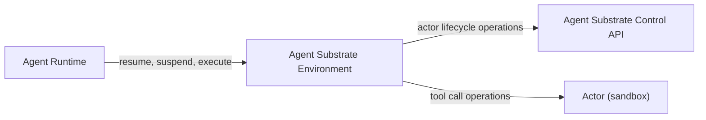

# Agent Substrate Environment

A lightweight **environment service** for [Agent Substrate](https://github.com/agent-substrate/substrate). It exposes a small API that lets an agent runtime
run tools — file operations and shell commands — inside session-tenant sandboxed actors.

Each session maps to a sandboxed **actor** in Agent Substrate.
This service runs inside the actor: it manages the actor's lifecycle (create →
resume → suspend) via the Agent Substrate control API, and executes incoming
tool calls in-process against the local environment. It returns tool call
responses.

---

## Overview



1. **`resume`** — creates an actor (idempotent) via Agent Substrate and resumes it.
1. **`suspend`** — suspends the actor.
1. **`execute`** — runs tool calls in-process (local file ops and shell commands) and returns tool responses.

The service is stateless: every request identifies both the environment and the
session in the URL path, so no per-session state is kept in memory.

---

## Configuration

Configuration is loaded from `config.yaml` in the working directory. If the file is missing, built-in defaults are used. Any field left empty falls back to its default.

```yaml
# Address/port for this HTTP service to listen on
listen: ":8080"

ate:
  # Agent Substrate ateapi gRPC server
  ateapi: "ateapi.ate-system.svc.cluster.local:443"

  # Namespace used to create/resume actors
  namespace: "default"

# Predefined environments mapping client-facing names to Agent Substrate templates.
environments:
  - name: "bash-env"
    template: "bash-env-template"
    enabled_tools:
      - "bash"
      - "read_file"
      - "write_file"
      - "list_dir"
```

| Field           | Default            | Description                                             |
| --------------- | ------------------ | ------------------------------------------------------- |
| `listen`        | `:8080`            | Bind address. A bare port (e.g. `8080`) is auto-prefixed with `:`. |
| `ate.ateapi`    | `ateapi.ate-system.svc.cluster.local:443` | Agent Substrate gRPC address (create/resume/suspend actors). |
| `ate.namespace` | `default`          | Actor template namespace.                               |
| `environments`  | `bash-env` -> `bash-env-template` | List of predefined client-facing environment to Agent Substrate template mappings. |

---

## API

All endpoints accept and return JSON. The environment (`{env}`) and session (`{session_id}`) are always part of the URL path.

### `POST /v1/environments/{env}/sessions/{session_id}/resume`

Create (if needed) and resume the actor for the session in `{env}`. No request body.

- `{env}` — client-facing environment name, e.g. `bash-env` (**required**)
- `{session_id}` — unique session identifier (**required**)

**Response:** `{ "status": "ok" }`


### `POST /v1/environments/{env}/sessions/{session_id}/suspend`

Suspend the session's actor. No request body.

**Response:** `{ "status": "ok" }`


### `POST /v1/environments/{env}/sessions/{session_id}`

Execute one or more tool calls in the session's actor. The session must have been resumed first. Only tools configured/enabled for `{env}` can be executed.

```json
{
  "env_variables": [
    { "name": "MY_SECRET", "value": "c3ebfdfdk12345..." }
  ],
  "inputs": [
    {
      "call_id": "call_1",
      "type": "function",
      "function": {
        "name": "bash",
        "arguments": "{\"command\": \"echo hi && ls\"}"
      }
    }
  ]
}
```

- `env_variables` — env vars merged into command executions for this call
- `inputs` — list of tool calls to execute (**required**)

**Response:**

```json
{
  "outputs": [
    {
      "name": "bash",
      "call_id": "call_1",
      "content": "hi\n..."
    }
  ]
}
```

---

## Supported tools

All tool calls run in-process in this binary. The `bash` tool executes the command locally with `sh -c` via `os/exec`. File operation tools (`read_file`, `write_file`, `list_dir`) use the Go standard library directly — they never shell out.

| Tool          | Arguments                    | Behavior                                            |
| ------------- | ---------------------------- | --------------------------------------------------- |
| `bash`        | `command` (or `code`/`cmd`)  | Runs the command locally with `sh -c` (`os/exec`); per-call env vars are merged in. |
| `read_file`   | `path`                       | Reads and returns the file contents (`os.ReadFile`). |
| `write_file`  | `path`, `content`            | Creates parent dirs (`os.MkdirAll`) and writes the content (`os.WriteFile`). |
| `list_dir`    | `path` (defaults to `.`)     | Lists the directory (`os.ReadDir`), `ls -la` style. |

---

## Example: end-to-end with curl

```bash
SID=123e4567-e89b-12d3-a456-426614174000

# 1. Resume the session
curl -sX POST localhost:8080/v1/environments/bash-env/sessions/$SID/resume

# 2. Run a tool call with env vars
curl -sX POST localhost:8080/v1/environments/bash-env/sessions/$SID \
  -H 'Content-Type: application/json' \
  -d '{"env_variables":[{"name":"MY_SECRET","value":"c3ebfdfdk12345..."}],"inputs":[{"call_id":"c1","type":"function","function":{"name":"bash","arguments":"{\"command\":\"uname -a\"}"}}]}'

# 3. Suspend when done
curl -sX POST localhost:8080/v1/environments/bash-env/sessions/$SID/suspend
```

---

## Notes & limitations

- The service is completely **stateless** — restarting the service is safe and does not lose any session state (actors persist in Agent Substrate).
- A non-zero exit code from a command is surfaced as an error in the tool response `content`.

## License

Apache 2.0 — see the license headers in source files.
